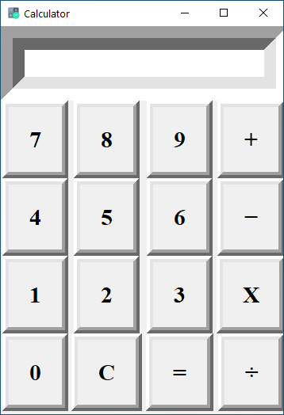

# Simple Calculator
Python based GUI calculator using Tkinter library 

This is my first python project. From the very start I had an interest in GUIs, so I learnt the basics of tkinter and developed this project.

## Description
This application can perform simple mathematical applications like Addition, Subtraction, Multiplication and Divison.

## Future Scope
This basic application further can be upgraded to Scientific Calculator with many complex operations like trignometric operations, logarithmic operations,etc.

